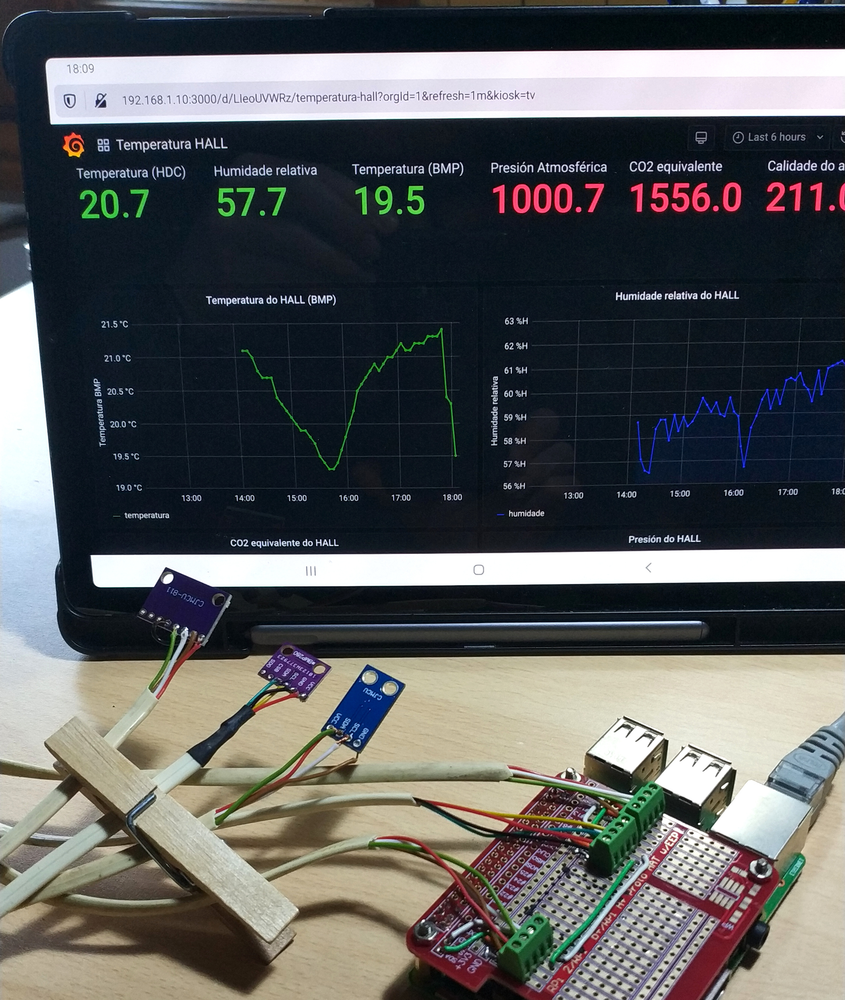

# IoT no Rural

Este espazo serve para construir e promover recursos de IoT en entornos rurais.

## Motivación e _disclaimer_

A motivación inicial deste proxecto foi construir pequenas estacións de medida e actuación para a horta:

+ que envíen información de sensores e reciban ordes de actuación,
+ que sexan baratas e relativamente sinxelas de construir,
+ que poidan funcionar sen cables para a alimentación ou transmisión de datos,
+ que sexan resistentes para ser usadas no exterior durante anos,
+ e que se integren nun sitema IoT de control que funcione de forma resilente, fiable e segura.

Eu non teño o coñecemento técnico para conseguir estes oxectivos. Síntome cómodo traballando con GNU/Linux e coa Raspberry Pi, pero sei moi pouco de electrónica, de programación ou de bases de datos. O xusto para copiar e pegar código e esquemas de circuitos e modificalos para que fagan algo parecido ao que necesito.

A maioría dos elementos incorporados ata agora son traballos de outras persoas amparados baixo algunha licencia libre. O que aporta este proxecto é a integración de todos estes elementos.

Así que __perdoa as ñapas__ que vexas, __non sexas moi duro__ cando indiques os erros e ten en conta que __igual non entendo á primeira__ as propostas de mellora que fagas.

Levar adiante este proxecto serve para aprender, descubrir e inventar un montón de cousas. A medida que se avanza e se logran novas prestacións, xurden necesidades e aparecen problemas que son unha oportunidade para entender e aprender algo novo.

O proxecto é bastante complexo e reúne tecnoloxías moi diferentes, desde facer o [código en `C++` para ler a temperatura cun sensor HDC1080](https://github.com/pintafontes/Servidor-Raspberry/blob/master/sensors/HDC1080_mqtt.py) ata deseñar e imprimir unha peza de PETG para [poñer o pluviómetro nun poste](https://github.com/pintafontes/Estacion-Meteoroloxica).

Agora estou adicando a maioría do tempo a organizar e completar toda a documentación necesaria para que o proxecto poida ser replicado por quen queira, esperando que desta forma outras persoas poidan contribuir coa súa experiencia e coñecementos a lograr a motivación principal.

## Indice de repositorios

Dependendo dos teus intereses e coñecementos, podes usar estas guías como máis che conveña. Pero eu recoméndoche que tentes replicar o proxecto na orde suxerida:

1 - [Servidor IoT sobre Raspberry Pi](https://github.com/pintafontes/Servidor-Raspberry): 
Nesta fase do proxecto conseguimos usar unha Raspberry Pi como unha _centralita de comunicacións_ para dispositivos de **I**nternet **o**f **T**hings (**IoT**). Tamén usaremos a **R**aspberry **Pi** (**RPi**) como dispositivo IoT ao que conectaremos algúns sensores.  
A RPi funcionará coa distrubución Debian de GNU/Linux e executaremos tres servizos diferentes que compoñen o software de comunicación e procesado dos datos: [Mosquitto](https://mosquitto.org/); [InfluxDB](https://www.influxdata.com/products/influxdb/) e [Grafana](https://grafana.com/)

2 - [Estación meteorolóxica](https://github.com/pintafontes/Estacion-Meteoroloxica) (documentación incomlpleta): 
Tras a posta en marcha do servidor construiremos unha pequena estación meteorolóxica baseada en ESP8266. Medirá a temperatura e humidade exterior e a pluviometría e comunicará esta información ao noso servidor por Wifi na rede local 
De momento o ESP8266 recibe a alimentación desde a rede eléctrica doméstica.

3.-[Unidade Móbil OLED](https://github.com/pintafontes/Unidade-Mobil-OLED) (sen documentación): 
Este dispositivo consiste nun ESP8266 cun un sensor DHT22 (temperatura e humidade) e unha minúscula pantalla OLED onde se presentan as mediads do propio dispositivo e outra información da rede MQTT. 
Tamén recibe a alimentación desde a rede eléctrica doméstica, e non parece viable cambiar isto polo consumo da pantalla. O dispositivo da algúns problemas de conxestion da rede Wifi que non fun quen de resolver.

## Logros e traballo pendente por facer (TO-DO)
- [x] Montar un servidor local na RPi con MQTT, InfluxDB e Grafana.
Habilitar o acceso á RPi por SSH mediante claves asimétricas.
  - [ ] Automatizar unha copia de seguridade da base de datos noutro dispositivo diferente.
  - [ ] Crear arquivo de configuración para centralizar as variables usadas nos scripts, como enderezos IP, topics, acceso Wifi, etc.
  - [ ] Substituir o script `influxdb_mqtt.service` por algo con licencia libre.
  - [ ] Publicar os datos dos sensores en formato JSON.
- [ ] Montar un servidor público na RPi con MQTT, InfluxDB e Grafana.
- [x] Construir unha estación meteorolóxica con ESP8266 e comunicación Wifi.
    - [ ] Substiruir a comunicación Wifi por LORA.
- [x] Ordenar os arquivos e scripts de forma coherente e sinxela.
    - [ ]
- [ ] Deseño e construcción dunha protoboard para conectar os diferentes sensores aos terminais I2C do GPIO

- [ ] Incluir a comunicación por LORA Monocanle
